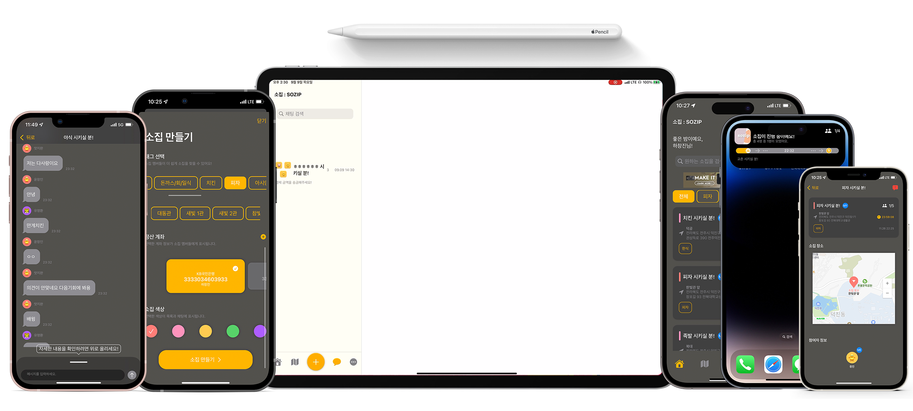

 

# 소집 : SOZIP  
### An Application for Delivery Cost Dutch Pay 
###### '소집(SOZIP) means to gather (people, etc.) in Korean.'
ⓒ 2021 Changjin Ha, Sojung Moon. All Rights Reserved.  

## Features 
#### Home 
> Check any SOZIPs near by you, or notifications  

 

#### SOZIP Map 
> Check and contact to all SOZIPs  

 

#### SOZIP 
> Check location, participants, or manage your SOZIP in SOZIP Details 

 

> Don't you have a favorite SOZIP? Feel free to make it! 

 

#### Chat 
> Feel free to talk to the participants  

 

> Or you can send any images, back accounts, or manage your SOZIP. it's so easy.  

 

#### Profile 
> Show others your unique personality in your profile  

 

#### Feedback Hub 
> Improve 소집 : SOZIP with your opinion.  

 

#### And so much more. 
> Notice, Consult, or you can change your informations  

